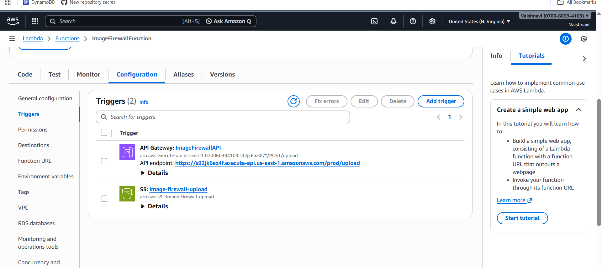
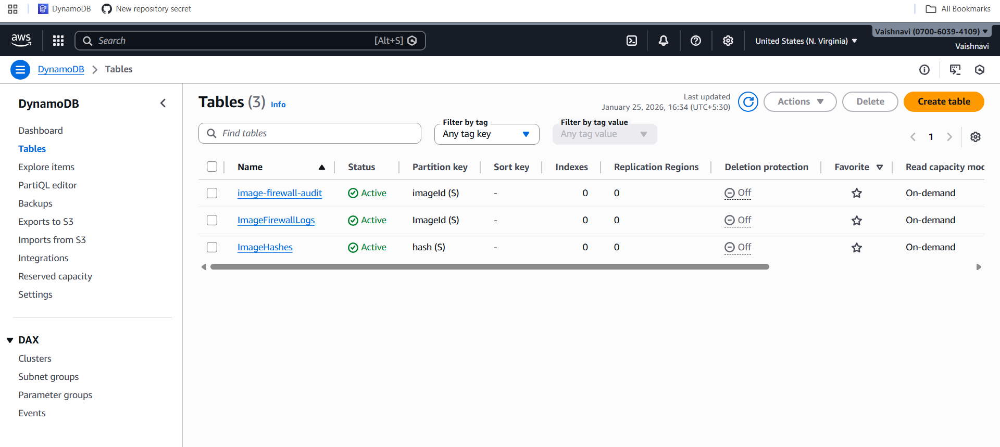

# Serverless Image Firewall (AWS)

A serverless image security system that automatically scans uploaded images, detects unsafe content, quarantines risky images, logs all actions, and sends email alerts.

---

## 🚀 Architecture Overview

User Upload  
→ S3 Upload Bucket  
→ Lambda (ImageFirewallFunction)  
→ Rekognition Moderation Check  
→ Allowed / Quarantine Bucket  
→ DynamoDB Audit Logs  
→ SNS Email Alert  

---

## 🛠 AWS Services Used

- **AWS Lambda** – Core image processing logic  
- **Amazon S3** – Image storage  
- **Amazon Rekognition** – NSFW & moderation detection  
- **Amazon DynamoDB** – Audit logging  
- **Amazon SNS** – Email notifications  
- **Amazon CloudWatch** – Logs & monitoring  

---

## 📍 Region
- **US East (N. Virginia)** – `us-east-1`

---

## 📦 S3 Buckets

| Bucket Name | Purpose |
|------------|--------|
| image-firewall-upload | Initial image uploads |
| image-firewall-allowed | Safe images |
| image-firewall-quarantine | Unsafe / rejected images |

---

## 🧠 Lambda Function

- **Name:** `ImageFirewallFunction`
- **Trigger:** S3 `ObjectCreated` on `image-firewall-upload`
- **Runtime:** Python 3.x

### Function Responsibilities
- Validate image size
- Scan image using Rekognition
- Decide ALLOWED or QUARANTINED
- Move image to correct bucket
- Log decision in DynamoDB
- Send email alert if quarantined

---

## 📊 DynamoDB Audit Table

- **Table Name:** `image-firewall-audit`
- **Partition Key:** `imageId (String)`

### Stored Fields
- imageId  
- fileName  
- bucket  
- decision  
- reason  
- confidence  
- timestamp  

---

## 📧 SNS Email Alerts

- **Topic Name:** `image-quarantine-alert`
- Sends email when:
  - NSFW content detected
  - File size exceeds limit

---

## 🔐 Rekognition Rules

- Uses `detect_moderation_labels`
- **MinConfidence:** 50%
- If any moderation label detected → **QUARANTINE**

---

## 🧪 How to Test

1. Upload a normal image → goes to **allowed bucket**
2. Upload NSFW or large image → goes to **quarantine bucket**
3. Check:
   - DynamoDB for logs
   - Email inbox for alert
   - CloudWatch logs for execution

---

## 📸 Screenshots

### S3 Buckets


### Lambda Trigger


### DynamoDB Audit Logs


### SNS Email Alert


---

## 📂 Repository Structure

```text
image-firewall/
├── lambda_function.py
├── screenshots/
│   ├── Screenshot- s3 bucket.png
│   ├── Screenshot- lambda-trigger - Copy.png
│   ├── Screenshot-dynamodb-table.png
│   └── Screenshot-sns-email.png
└── README.md
